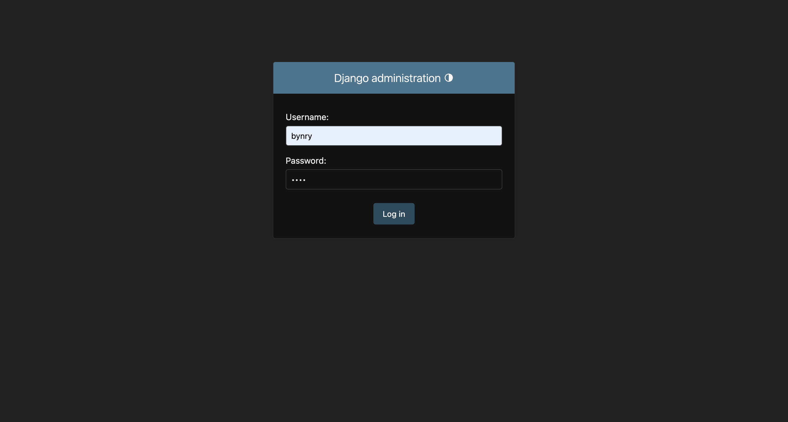
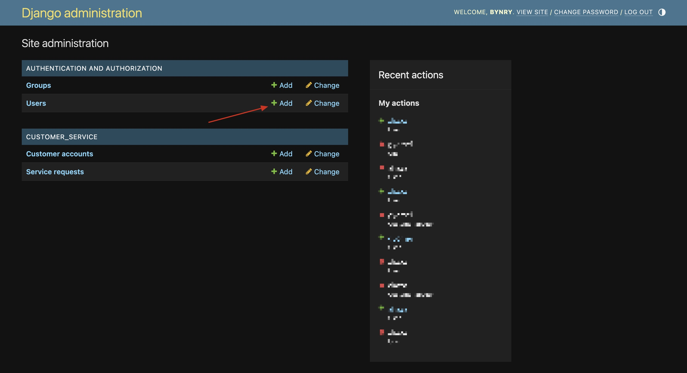
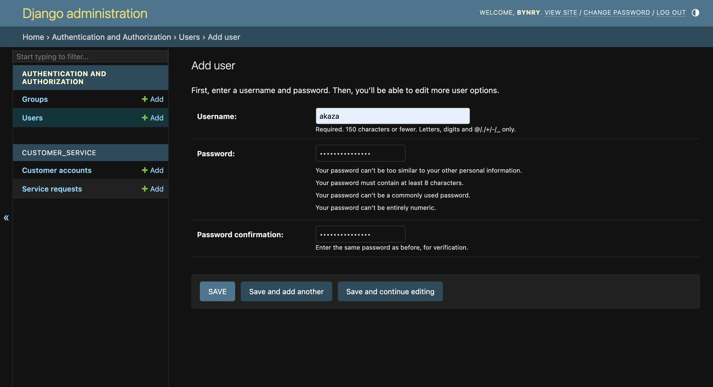
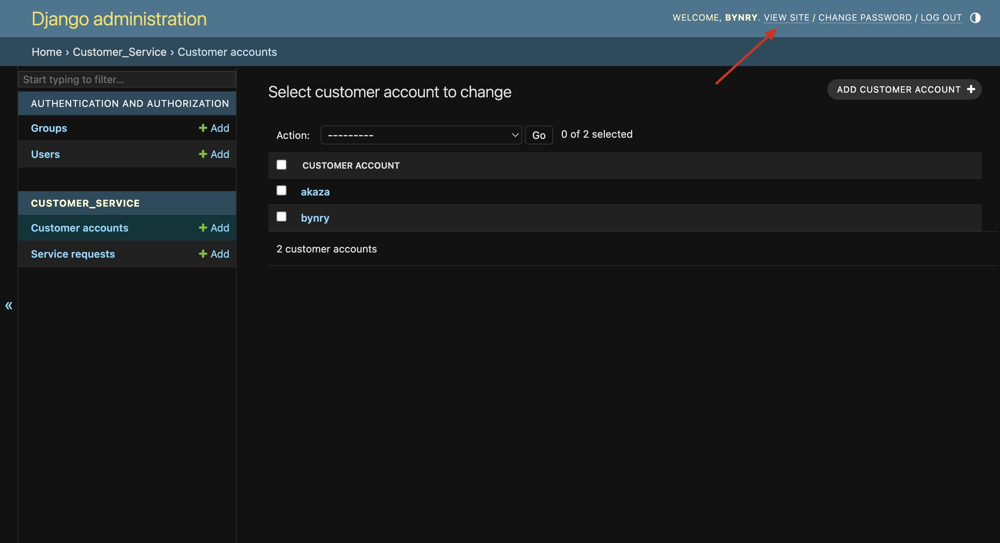
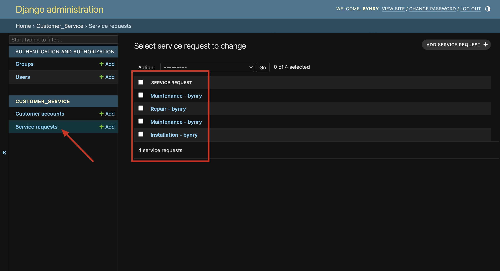
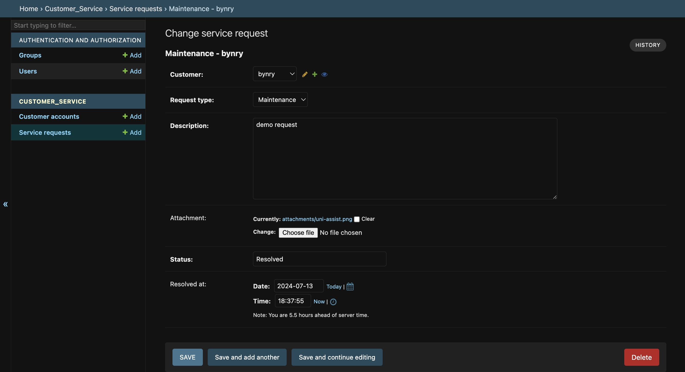

# Gas Utility Customer Service Application

This is a Django application for a gas utility company to handle customer service requests. The application allows customers to submit service requests online, track the status of their requests, and view their account information. Customer support representatives can manage requests and provide support to customers.

## Features

- **Service Requests**: Customers can submit service requests online, select the type of service, provide details, and attach files.
- **Request Tracking**: Customers can track the status of their service requests, view submission and resolution times.
- **Customer Support Management**: Customer support representatives can manage and respond to customer requests.

## Prerequisites

- Python 3.x
- Django 3.x
- pip (Python package installer)

## Installation

1. **Clone the Repository**:

   ```bash
   git clone https://github.com/Sahil-B07/Gas-Utility.git
   cd Gas-Utility
   ```

2. **Install Dependencies:**:
   ```bash
   pip install -r requirements.txt
   ```
3. **Create the Database:**:
   ```bash
   python manage.py makemigrations
   python manage.py migrate
   ```
4. **Create a Superuser:**:
   ```bash
   python manage.py createsuperuser
   ```
5. **Run the Development Server:**
   ```bash
      python manage.py runserver
   ```

## Setup

1. **Open Django Admin Panel: Login with the superUser http://127.0.0.1:8000/admin**

   

2. **Create a New User: It will automatically create a CUSTOMER Account with the same**

   
   

3. **Click VIEW SITE on the top-right corner**

   

## Access the Application

Open your web browser and navigate to:
http://127.0.0.1:8000/customer_service/submit/ to submit a service request and http://127.0.0.1:8000/customer_service/track/ to track service requests.

## Customer Support Management

Open django admin - locate service request - here you can update the status of the service



### Future scope

1. Could upgrade it to a Django Rest Api, which is more efficient.

2. For now I have kept the UI as simple as possible, but it can be enhanced.
